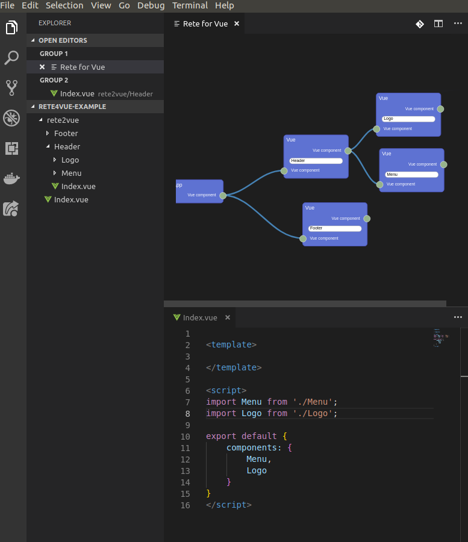

# Rete for Vue

VS Code extension for generation of Vue.js component using Rete.js.

Draft: on every scheme changes the generator will create .vue files with imports according to nodes and connections

### How to use

- Open tab: `F1 > Open Rete ...`

